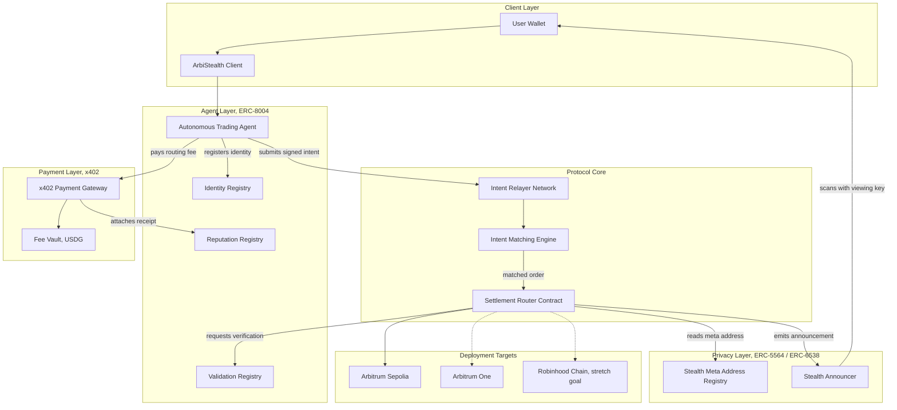

# ArbiStealth

**Private trade execution with verifiable agent accountability.**

ArbiStealth is a privacy-preserving, agent-driven intent settlement protocol built on Arbitrum. It lets users submit private trade intents that are executed by autonomous agents, settled to stealth addresses, and paid for through verifiable on-chain micropayments, without exposing the identity of the end recipient.

---

## Table of Contents

1. [Overview](#overview)
2. [Problem](#problem)
3. [Solution](#solution)
4. [Architecture](#architecture)
5. [Core Components](#core-components)
6. [Tech Stack](#tech-stack)
7. [Smart Contract Design](#smart-contract-design)
8. [Deployment Plan](#deployment-plan)
9. [SDK and Developer Integration](#sdk-and-developer-integration)
10. [Security Considerations](#security-considerations)
11. [Roadmap](#roadmap)
12. [Program Strategy](#program-strategy)
13. [Getting Started](#getting-started)
14. [Repository Structure](#repository-structure)
15. [Contributing](#contributing)
16. [License](#license)

---

## Overview

Most DEX activity on public chains leaks two things: who is trading, and what an autonomous agent acting on a user's behalf actually did. ArbiStealth separates these concerns instead of trying to hide everything or reveal everything.

- The **destination of a trade** stays private, using stealth addresses (ERC-5564 and ERC-6538), so a trade cannot be trivially linked back to a user's known wallet.
- **What the agent did** stays fully verifiable, using an on-chain agent identity, reputation, and validation layer (ERC-8004), backed by real payment receipts (x402).

The result: private settlement, public accountability.

---

## Problem

1. Intent-based DEXs broadcast enough metadata (sender, size, timing) to enable front-running and MEV extraction.
2. Users who want privacy for the destination of their funds currently have to trust wallet-level tools with no execution logic attached (see: Fluidkey), or complex mixers with poor UX.
3. As trading agents become common, there is no standard way to prove what an agent actually executed on a user's behalf, unless you sacrifice the privacy of the trade itself.
4. Existing agent frameworks lack a portable, chain-native reputation system that ties directly to real settled payments rather than self-reported logs.

---

## Solution

ArbiStealth combines three existing standards into one settlement flow instead of inventing new cryptography:

| Layer | Standard | Purpose |
|---|---|---|
| Privacy | ERC-5564 + ERC-6538 | Generate one-time stealth addresses for trade output, announced on-chain but unlinkable without the viewing key |
| Agent Identity | ERC-8004 | Give the executing agent a portable on-chain identity, reputation history, and validation trail |
| Settlement | x402 | Settle routing and execution fees as real, verifiable on-chain payments, attachable as proof to the agent's reputation entry |

A user submits a signed intent once. From there, the agent takes over: it finds a match, executes through the settlement router, pays the routing fee via x402, and the output lands in a stealth address only the user can identify.

---

## Architecture



### Flow summary

1. User generates a stealth meta-address and registers it once via the meta-address registry.
2. User signs an intent (asset in, asset out, min output, expiry) and hands it to their agent.
3. Agent registers or reuses its ERC-8004 identity, then submits the intent to the relayer network.
4. The matching engine finds a counterparty or route, and the settlement router executes the trade.
5. Trade output is sent to a freshly derived stealth address, with an announcement event emitted on-chain so the user can scan and claim it.
6. The agent pays the routing fee through x402. The payment receipt is attached to the agent's reputation entry, so its track record is auditable without revealing who it traded for.

---

## Core Components

### 1. Stealth Order Layer
Wraps the canonical ERC-5564 announcer and ERC-6538 registry contracts. Responsible for stealth address derivation, announcement emission, and view-tag optimization so scanning stays cheap as volume grows.

### 2. Agent Identity Layer
Wraps the ERC-8004 Identity, Reputation, and Validation registries. Every agent operating on ArbiStealth must hold a registered identity before it can submit intents. Reputation entries reference the x402 receipt of the fee paid for that trade, so reputation is backed by real settlement, not self-reported claims.

### 3. Intent Matching Engine
Off-chain service that receives signed intents from the relayer network, finds viable counterparties or routes, and forwards matched orders to the settlement router for on-chain execution. Designed to be swappable, an early version can be a simple order book, later versions could route through existing Arbitrum liquidity.

### 4. Settlement Router
The on-chain contract that actually executes the matched trade, derives the stealth output address, and emits the announcement. This is the core trust boundary of the system and the primary target for a security review before any mainnet deployment.

### 5. Payment and Fee Layer
Routes all fees through x402, with USDG as the preferred settlement asset where available, since native stablecoin settlement gives cleaner proofs and better composability with reputation entries.

---

## Tech Stack

This is a recommended stack. Adjust based on comfort level and time available.

- **Smart contracts:** Solidity, Foundry for testing and deployment scripting
- **Backend / relayer / matching engine:** TypeScript, Node.js
- **Frontend client:** Next.js, wagmi/viem for wallet and contract interaction
- **Agent runtime:** TypeScript or Python service that holds the agent's ERC-8004 identity key and signs/submits intents
- **Indexing:** a lightweight subgraph or custom indexer for stealth announcements and reputation events
- **Testing:** Foundry unit and fuzz tests for contracts, Vitest or Jest for backend and SDK

---

## Smart Contract Design

| Contract | Responsibility |
|---|---|
| `IntentRegistry.sol` | Stores and validates signed user intents, enforces expiry and replay protection |
| `StealthAnnouncerAdapter.sol` | Thin wrapper around the canonical ERC-5564 announcer for protocol-specific event tagging |
| `StealthMetaRegistryAdapter.sol` | Thin wrapper around the canonical ERC-6538 registry |
| `SettlementRouter.sol` | Executes matched trades, derives stealth output, triggers announcement |
| `AgentIdentityAdapter.sol` | Reads and writes against the ERC-8004 Identity and Reputation registries |
| `FeeVault.sol` | Holds and distributes routing fees, integrates with x402 settlement flow |

Where possible, integrate with the canonical, already-deployed ERC-5564, ERC-6538, and ERC-8004 registries rather than redeploying your own copies. This keeps ArbiStealth composable with other tools already using those standards, and reduces the audit surface to just the ArbiStealth-specific contracts.

---

## Deployment Plan

| Phase | Chain | Goal |
|---|---|---|
| Phase 1 | Arbitrum Sepolia | Core protocol working end to end: intent, match, stealth settlement, agent identity, fee payment |
| Phase 2 | Arbitrum One | Mainnet deployment once contracts are reviewed and the flow is stable |
| Phase 3, stretch | Robinhood Chain | Port the settlement router and adapters to Robinhood Chain to compete for the reserved prize track, only after Phase 1 and 2 are solid |

Deployment addresses should be tracked in a `deployments/` folder, one JSON file per chain, checked into the repo as each phase completes.

---

## SDK and Developer Integration

Yes, an SDK is worth building, but treat it as a phase 2 deliverable that sits on top of a working protocol, not a blocker for the first working version.

**Recommended package:** `@arbistealth/sdk`, published to npm, written in TypeScript, bundled with tsup or a similar lightweight bundler so it stays tree-shakeable.

**What it should expose:**

- `generateStealthMetaAddress()`, wraps meta-address key generation and registration
- `scanAnnouncements(viewingKey)`, scans announcement events and returns claimable outputs for a user
- `submitIntent(intent, signature)`, submits a signed intent to the relayer network
- `registerAgent(agentMetadata)`, handles ERC-8004 identity registration for a new agent
- `getAgentReputation(agentId)`, reads reputation and validation history for a given agent
- `payWithX402(amount, asset)`, thin helper around the x402 payment flow for fee settlement

Publishing this to npm turns ArbiStealth from a demo into infrastructure other teams can build on top of, which is a meaningful product-market fit signal for judges and grant reviewers, but the sequencing matters: ship the working protocol first, extract the SDK from real usage second. An SDK built before the protocol stabilizes usually needs a breaking rewrite anyway.

---

## Security Considerations

- **Replay protection:** every intent must include a nonce and expiry, enforced by `IntentRegistry`.
- **Front-running mitigation:** consider a commit-reveal pattern for intent submission if the matching engine becomes a target.
- **Key management:** stealth viewing and spending keys are user-held. The protocol should never have a path where it could reconstruct a user's spending key.
- **Agent key custody:** agent signing keys should be isolated from any key that controls real user funds directly. Compromising an agent key should, at worst, damage that agent's reputation, not drain funds.
- **Audit scope:** before any Arbitrum One deployment, `SettlementRouter.sol` and `FeeVault.sol` are the highest-priority contracts for a third-party review.

---

## Roadmap

1. **Core protocol:** intent submission, matching, stealth settlement, working end to end on Arbitrum Sepolia
2. **Agent layer integration:** ERC-8004 identity and reputation wired into the settlement flow, x402 fee payments attached as reputation proof
3. **USDG integration:** settle fees in USDG for the extra consideration flagged in the hackathon judging criteria
4. **SDK extraction:** `@arbistealth/sdk` published to npm once the protocol is stable
5. **Arbitrum One deployment:** after internal review of the settlement router and fee vault
6. **Robinhood Chain port:** stretch goal, once Phases 1 through 5 are solid

---

## Program Strategy

A few notes on how this project fits into the Arbitrum Open House Singapore program:

- **Buildathon submission and a direct Founder House application are not mutually exclusive.** Arbitrum's own program materials state founders may apply to the Buildathon, Founder House, or both. Submit ArbiStealth to the Buildathon for a shot at the podium, and separately submit a direct Founder House application citing ArbiStealth as your existing, working product. Do both, do not wait on one before starting the other.
- **The $30K USDC grant pool is discretionary and not a separate application.** It is awarded case by case to selected teams from either track, at the Arbitrum Foundation's sole discretion. There is nothing extra to fill out for this beyond having a strong, working submission.
- **USDG integration is an explicit judging bonus** in both the Overall and Promising Products tracks. Settling fees or trade output in USDG rather than a generic token is a low-effort way to pick up that extra consideration.
- **Deployment requirement:** a project must be deployed on an Arbitrum chain to qualify at all, Arbitrum Sepolia, Arbitrum One, or Robinhood Chain all count. Phase 1 alone already satisfies this.

---

## Getting Started

### Prerequisites

- Node.js 20 or later
- pnpm or yarn
- Foundry (`curl -L https://foundry.paradigm.xyz | bash`)
- An Arbitrum Sepolia RPC endpoint and a funded test wallet

### Setup

```bash
git clone https://github.com/anbusan19/arbistealth.git
cd arbistealth
pnpm install
cp .env.example .env
# fill in RPC_URL, PRIVATE_KEY, and any registry addresses in .env
```

### Contracts

```bash
cd contracts
forge install
forge build
forge test
```

### Deploy to Arbitrum Sepolia

```bash
forge script script/Deploy.s.sol \
  --rpc-url $ARBITRUM_SEPOLIA_RPC \
  --private-key $PRIVATE_KEY \
  --broadcast
```

### Backend and relayer

```bash
cd apps/relayer
pnpm install
pnpm dev
```

---

## Repository Structure

```
arbistealth/
├── contracts/
│   ├── src/
│   │   ├── IntentRegistry.sol
│   │   ├── StealthAnnouncerAdapter.sol
│   │   ├── StealthMetaRegistryAdapter.sol
│   │   ├── SettlementRouter.sol
│   │   ├── AgentIdentityAdapter.sol
│   │   └── FeeVault.sol
│   ├── test/
│   └── script/
├── apps/
│   ├── relayer/         # intent relayer and matching engine
│   └── web/             # user-facing client
├── packages/
│   └── sdk/              # @arbistealth/sdk, phase 2
├── deployments/
│   ├── arbitrum-sepolia.json
│   ├── arbitrum-one.json
│   └── robinhood-chain.json
└── docs/
    └── architecture.md
```

---

## License

MIT